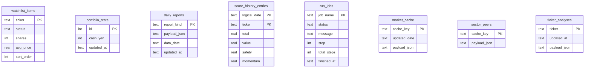

# ADR-001: 永続化を JSON ファイルから SQLite へ移行する

| 項目 | 内容 |
|------|------|
| ステータス | 承認（設計完了・実装は DB-2 以降） |
| 日付 | 2026-05-22 |
| 関連 Issue | DB-1（設計）、DB-2〜DB-7、GitHub #15（本番データ移行） |

---

## Context

DPA / stock_v7 は単一ユーザー前提で、状態は主に JSON ファイルに保存されている。

| パス | 用途 | 主な読み書き |
|------|------|--------------|
| `data/watchlist.json` | ウォッチリスト・保有（HOLDING） | `core/utils/watchlist_io.py`, `web/api.py` |
| `portfolio_state.json` | 現金残高 | `web/api.py`, `daily_routine.py`, `send_daily_report.py` |
| `data/last_report.json` | 最新日次レポート | `daily_routine.py`, `web/api.py`, `send_daily_report.py` |
| `data/previous_report.json` | 前回日次レポート | 同上 |
| `data/scores_history.json` | 論理日付 × 銘柄のスコア履歴 | `core/dpa/dpa_scores.py`, `daily_routine.py` |
| `data/run_status.json` | バッチ進捗 | `web/api.py`, `daily_routine.py` |
| `data/daily_cache.json` | マクロ・ベンチマーク OHLC キャッシュ | `core/utils/daily_cache.py` |
| `data/sector_peers.json` | セクター別ピア銘柄マスタ | `core/dvc/data_fetcher.py` |
| `output/<ticker>.json` | DVC 分析結果（1 銘柄 1 ファイル） | `core/dvc/dvc_batch.py`, `web/api.py` |

課題:

- ファイル直書きによる競合・部分更新リスク（取引 API とバッチの同時実行）
- 本番 VPS（`/opt/dpa_app`）と Mac 開発環境で JSON を Git 同期している場合、DB ファイルと方針が衝突しうる
- 移行時に **本番 JSON を欠落なく** DB に取り込む必要がある（Epic 要件 #15）

**スコープ外（本 ADR）:** `token.json` / `credentials.json` / `.env` / `config.yaml`（Phase 1 ではファイルのまま）

---

## Decision

### 1. データベース製品

**SQLite 3 のみ**を採用する（Mac 開発・ConoHa VPS 本番の両方）。

| 案 | 判定 | 理由 |
|----|------|------|
| SQLite | **採用** | 単一プロセス・単一ユーザー、運用が軽い、バックアップがファイルコピーで足りる |
| PostgreSQL | **今回は不採用** | ホスティング・接続管理のコストに対しメリットが小さい。将来マルチインスタンス化時に再検討 |
| JSON ファイル継続のみ | 却下 | Epic 目的（トランザクション・整合）を満たさない |

### 2. アクセス層

- **SQLAlchemy 2.x** + 宣言的モデル（DB-2 で `requirements.txt` に追記）
- **Repository パターン**: `core/persistence/` に Protocol を定義し、まず `File*Repository`（現行 JSON）、続けて `Sqlite*Repository`（DB-3 以降）
- 接続 URL は環境変数 **`DPA_DATABASE_URL`**（未設定時は `sqlite:///data/dpa.db` をプロジェクトルート相対で解釈）

例:

```text
# 開発（リポジトリルート基準）
sqlite:///data/dpa.db

# 本番 VPS（絶対パス推奨）
sqlite:////opt/dpa_app/data/dpa.db
```

### 3. 同時実行・整合

- **前提**: uvicorn ワーカー 1 プロセス、単一オペレータ
- SQLite **WAL モード**を接続時に有効化（`PRAGMA journal_mode=WAL`）
- 購入・売却・ウォッチリスト更新は **1 トランザクション**で `watchlist_items` + `portfolio_state` を更新（DB-3）
- **切替方針**: 移行完了までは JSON が SoT。DB 切替は設定フラグ（例: `persistence.backend: sqlite` in `config.yaml` または `DPA_PERSISTENCE=sqlite`）で **一括**行い、**二重書き込みは行わない**

### 4. `daily_reports` の格納方針（決定）

`last_report` / `previous_report` はネストが深くフィールドが多い（`ticker_names`, `target_weights`, `purge`, `draft`, `report_text` 等）。

**採用:** `daily_reports` テーブルに **`payload` JSON 列（TEXT）** でファイル内容をそのまま保存。

- `report_kind`: `'last'` | `'previous'`（UNIQUE）
- 正規化は行わない（移行リスク低・`get_report_merged` の互換が容易）
- 将来、検索が必要なキー（`data_date`, `phase`）だけ generated column またはインデックス用列を追加可能（Open Questions 参照）

---

## Schema

### ER 図（論理）



### テーブル定義（DDL 草案）

```sql
-- ウォッチリスト（旧 data/watchlist.json）
CREATE TABLE watchlist_items (
  ticker       TEXT PRIMARY KEY,
  status       TEXT NOT NULL DEFAULT 'WATCHING',  -- WATCHING | HOLDING
  shares       INTEGER,                            -- HOLDING 時。NULL 可
  avg_price    REAL,
  sort_order   INTEGER NOT NULL DEFAULT 0,         -- JSON 配列順を保持
  updated_at   TEXT NOT NULL DEFAULT (datetime('now'))
);

-- 現金（旧 portfolio_state.json）。単一行 id=1
CREATE TABLE portfolio_state (
  id           INTEGER PRIMARY KEY CHECK (id = 1),
  cash_yen     INTEGER NOT NULL,                   -- 整数円（yen_floor 後）
  updated_at   TEXT NOT NULL DEFAULT (datetime('now'))
);

-- 日次レポート（旧 last_report / previous_report）
CREATE TABLE daily_reports (
  report_kind  TEXT PRIMARY KEY,                   -- 'last' | 'previous'
  payload_json TEXT NOT NULL,                      -- 元 JSON 全文
  data_date    TEXT,                               -- 検証・一覧用（payload から複写）
  updated_at   TEXT NOT NULL DEFAULT (datetime('now'))
);

-- スコア履歴（旧 scores_history.json を正規化）
CREATE TABLE score_history_entries (
  logical_date TEXT NOT NULL,                      -- 例: 2026-03-09（JST 論理日）
  ticker       TEXT NOT NULL,
  total        REAL,
  value        REAL,
  safety       REAL,
  momentum     REAL,
  PRIMARY KEY (logical_date, ticker)
);
CREATE INDEX idx_score_history_ticker ON score_history_entries (ticker);

-- バッチ進捗（旧 run_status.json）
CREATE TABLE run_jobs (
  job_name     TEXT PRIMARY KEY DEFAULT 'daily_batch',
  status       TEXT,
  message      TEXT,
  step         INTEGER,
  total_steps  INTEGER,
  finished_at  TEXT
);

-- 日次マーケットキャッシュ（旧 daily_cache.json）
CREATE TABLE market_cache (
  cache_key    TEXT PRIMARY KEY DEFAULT 'main',
  updated_date TEXT,
  payload_json TEXT NOT NULL
);

-- セクターピアマスタ（旧 sector_peers.json）
CREATE TABLE sector_peers (
  cache_key    TEXT PRIMARY KEY DEFAULT 'default',
  payload_json TEXT NOT NULL
);

-- DVC 分析（旧 output/<ticker>.json）
CREATE TABLE ticker_analyses (
  ticker       TEXT PRIMARY KEY,
  updated_at   TEXT NOT NULL,
  payload_json TEXT NOT NULL                           -- DvcScoreOutput 相当
);
CREATE INDEX idx_ticker_analyses_updated ON ticker_analyses (updated_at);
```

### JSON → カラム マッピング

#### `data/watchlist.json`（配列）

| JSON フィールド | DB 列 | 備考 |
|-----------------|-------|------|
| `ticker` / `ticker_symbol` | `ticker` | 正規化後を PK。`watchlist_io._ticker()` と同じ規則 |
| `status` | `status` | 省略時 `WATCHING` |
| `shares` / `shares_held` | `shares` | HOLDING のみ。整数 |
| `avg_price` | `avg_price` | 任意 |
| 配列インデックス | `sort_order` | 移行時に付与 |

#### `portfolio_state.json`

| JSON | DB |
|------|-----|
| `cash_yen` | `portfolio_state.cash_yen`（INTEGER、読み込み時 `yen_floor`） |

#### `data/last_report.json` / `previous_report.json`

| JSON | DB |
|------|-----|
| （ルートオブジェクト全体） | `daily_reports.payload_json` |
| — | `report_kind` = `last` / `previous` |
| `data_date` | `data_date`（検証用に複写） |

主要トップレベルキー（payload 内に保持）: `created_at`, `data_date`, `target_cash_ratio`, `phase`, `phase_name_ja`, `vi_z`, `macd_trend`, `cash_yen`, `total_capital_yen`, `equity_value_yen`, `ticker_names`, `last_prices`, `current_weights`, `target_weights`, `score_trends`, `portfolio_scores`, `purge`, `draft`, `report_text`.

#### `data/scores_history.json`

```json
{ "2026-03-09": { "2502.T": { "total", "value", "safety", "momentum" } } }
```

| JSON | DB |
|------|-----|
| 外側キー | `logical_date` |
| 内側キー | `ticker` |
| 各スコア | `total`, `value`, `safety`, `momentum` |

#### `data/run_status.json`

| JSON | DB |
|------|-----|
| `status` | `run_jobs.status` |
| `message` | `run_jobs.message` |
| `step` | `run_jobs.step` |
| `total_steps` | `run_jobs.total_steps` |
| `finished_at` | `run_jobs.finished_at` |
| — | `job_name` = `'daily_batch'` |

#### `data/daily_cache.json`

| JSON | DB |
|------|-----|
| ルート全体 | `market_cache.payload_json` |
| `updated_date` | `market_cache.updated_date` |
| — | `cache_key` = `'main'` |

ルート例: `updated_date`, `benchmark_ticker`, `years`, `benchmark_history`（pandas split orient）, 銘柄別キャッシュ等。

#### `data/sector_peers.json`

| JSON | DB |
|------|-----|
| ルート（セクター名 → ティッカー配列） | `sector_peers.payload_json` |

#### `output/<ticker>.json`

| JSON | DB |
|------|-----|
| ファイル名のティッカー | `ticker` PK |
| ルート全体 | `payload_json` |
| mtime または `data_overview` 内日付 | `updated_at`（移行スクリプトで設定） |

ペイロード構造は [`core/dvc/schema.py`](../core/dvc/schema.py) の `DvcScoreOutput` 相当（`ticker`, `name`, `sector`, `scores`, `market_linkage`, `risk_metrics`, `ai_analysis`, `data_overview`）。

---

## 読み書き境界（DB-2〜DB-4 担当分割）

| モジュール | 現状 | DB 化 Issue |
|------------|------|-------------|
| `core/utils/watchlist_io.py` | `watchlist.json` | DB-3 |
| `web/api.py`（trade, settings cash, watchlist DELETE） | watchlist + portfolio + reports + run_status + output | DB-3, DB-4, DB-5 |
| `daily_routine.py` | 上記 + scores_history + cache | DB-3, DB-4, DB-5 |
| `send_daily_report.py` | watchlist, portfolio, reports | DB-4 |
| `core/dpa/dpa_scores.py` | scores_history | DB-4 |
| `core/utils/daily_cache.py` | daily_cache.json | DB-5 |
| `core/dvc/data_fetcher.py` | sector_peers.json | DB-5 |
| `core/dvc/dvc_batch.py` | watchlist path, output/*.json | DB-3, DB-5 |
| `web/main.py` | 一部 `_read_json`（表示用） | DB-3 経由に集約 |

### Repository インターフェース（DB-2 で定義予定）

| Protocol | 主要メソッド |
|----------|----------------|
| `WatchlistRepository` | `load_all`, `save_all`, `get_positions` |
| `PortfolioRepository` | `get_cash_yen`, `set_cash_yen` |
| `DailyReportRepository` | `get_last`, `get_previous`, `save_last`, `rotate_previous` |
| `ScoreHistoryRepository` | `get_for_date`, `append_date`, `load_all` |
| `RunJobRepository` | `get_status`, `update_status` |
| `MarketCacheRepository` | `load`, `save` |
| `SectorPeersRepository` | `load`, `save` |
| `TickerAnalysisRepository` | `get`, `save`, `list_tickers` |

実装: `File*`（現行）→ `Sqlite*`（DB-3〜5）。

---

## Migration（DB-6 / #15）

### 移行元（本番 `/opt/dpa_app`）

```
data/watchlist.json
portfolio_state.json
data/last_report.json
data/previous_report.json
data/scores_history.json
data/run_status.json
data/daily_cache.json          # 任意（サイズ大）
data/sector_peers.json
output/*.json
```

### 手順（概要）

1. **停止**: `systemctl stop dpa_web`（またはメンテナンス表示）
2. **バックアップ**:
   ```bash
   cd /opt/dpa_app
   cp -a data data.bak.$(date +%Y%m%d)
   cp -a portfolio_state.json portfolio_state.json.bak
   cp -a output output.bak.$(date +%Y%m%d)   # 任意
   cp -a data/dpa.db data/dpa.db.bak 2>/dev/null || true
   ```
3. **import**: `scripts/migrate_json_to_db.py --data-dir /opt/dpa_app`（DB-6 で実装）
   - `--dry-run`: 読み取り・件数ログのみ
4. **検証ログ**（必須）:
   - `watchlist_items` 件数 = JSON 配列長
   - `portfolio_state.cash_yen` = JSON `cash_yen`（整数円）
   - HOLDING 銘柄の `shares` / `avg_price` 一致
   - `daily_reports.last.data_date` = 旧 `last_report.data_date`
   - `score_history_entries` 行数 = JSON 日付×銘柄の総数
   - `ticker_analyses` 件数 = `output/*.json` ファイル数
5. **切替**: `DPA_PERSISTENCE=sqlite` または `config.yaml` → `systemctl start dpa_web`
6. **ロールバック**: 切替失敗時はフラグを `file` に戻し、`.bak` から JSON を復元

### Git 運用

- `data/dpa.db` は **Git に含めない**（DB-6 で `.gitignore` 追加）
- `git pull` は DB を上書きしない。本番 DB は VPS ローカルのみ

---

## Operations（SQLite 本番）

| 操作 | コマンド例 |
|------|------------|
| バックアップ | `sqlite3 /opt/dpa_app/data/dpa.db ".backup /opt/dpa_app/data/dpa.db.bak"` |
| 整合チェック | `sqlite3 data/dpa.db "PRAGMA integrity_check;"` |
| WAL | 初回接続時に `journal_mode=WAL` を適用 |

詳細手順は DB-7 で [`docs/OPERATIONS.md`](OPERATIONS.md) に追記する。

---

## Consequences

### メリット

- 取引・ウォッチリスト更新を ACID トランザクションで保護できる
- 本番 JSON のワンショット import でデータ欠落を防ぎやすい
- 単一ファイルで Mac / VPS で同じ運用モデル

### デメリット・トレードオフ

- `daily_reports` / `market_cache` / `ticker_analyses` は JSON blob が大きくなりうる
- SQLite は同時書き込みスレッドには不向き（現行アーキテクチャでは許容）
- 移行完了まで Repository 二重実装のメンテナンスコスト

---

## Open Questions

| # | 質問 | 現時点の方針 |
|---|------|----------------|
| 1 | `config.yaml` を `app_settings` テーブル化するか | **P3・後続 Issue**。Phase 1 はファイル維持 |
| 2 | `daily_reports` の `data_date` / `phase` を検索用に正規化列へ昇格するか | 当面は `payload_json` のみ。レポート検索需要が出たら列追加 |
| 3 | `daily_cache.json` を DB 化するか Mac でファイルのまま残すか | DB-5 で blob 化。サイズが問題ならベンチマーク部分のみ分割を検討 |
| 4 | 移行中に JSON と DB を短期併用するか | **しない**。フラグで SoT を一括切替 |
| 5 | PostgreSQL へ将来移行するか | マルチユーザー・複数ワーカー時に ADR を更新して再検討 |

---

## 実装フェーズ（参照）

| 順 | Issue | 成果物 |
|----|-------|--------|
| 1 | DB-2 | `core/persistence/`, `File*Repository`, pytest 不変 |
| 2 | DB-3 | SQLite: watchlist, portfolio, trade |
| 3 | DB-4 | SQLite: reports, scores, run_jobs |
| 4 | DB-5 | SQLite: market_cache, sector_peers, ticker_analyses |
| 5 | DB-6 | `scripts/migrate_json_to_db.py` |
| 6 | DB-7 / #15 | テスト、OPERATIONS 本番 DB 手順、VPS 受入 |

---

## 関連ドキュメント

- [`docs/ISSUE_BACKLOG.md`](ISSUE_BACKLOG.md) — Epic 一覧
- [`docs/OPERATIONS.md`](OPERATIONS.md) — デプロイ・本番セキュリティ（Issue #2）
