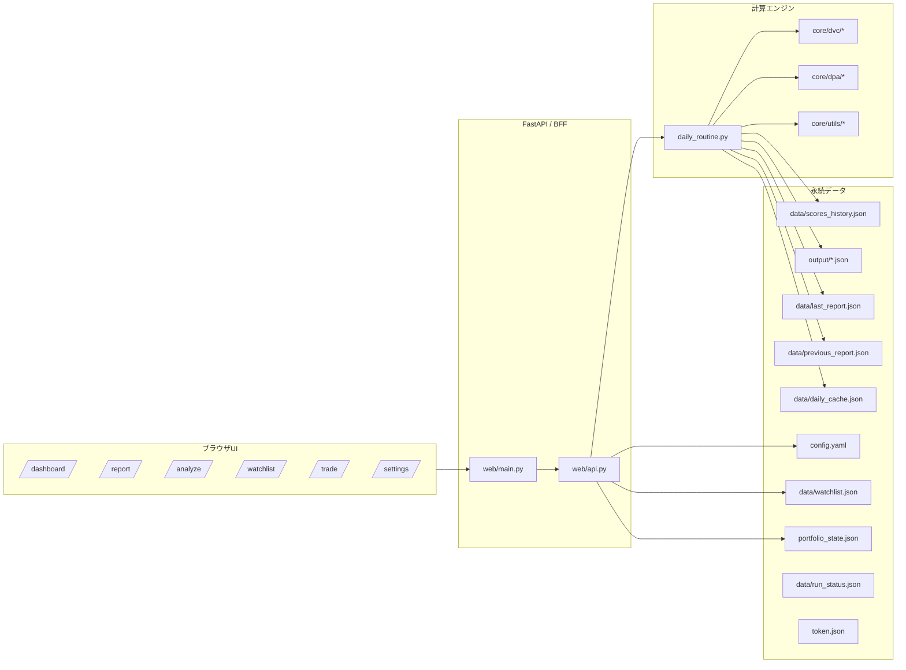
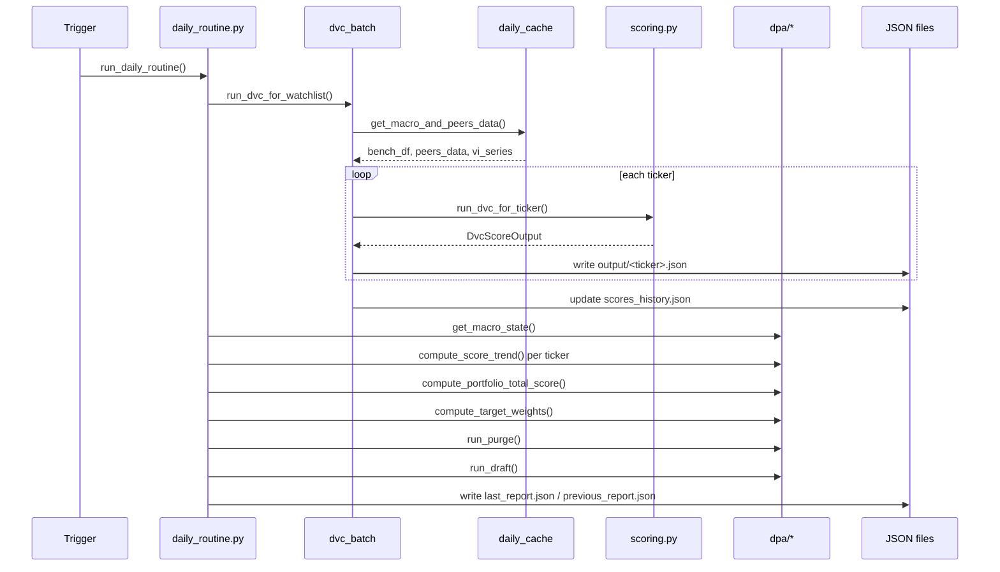
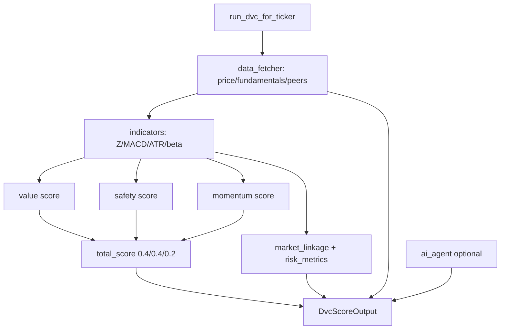
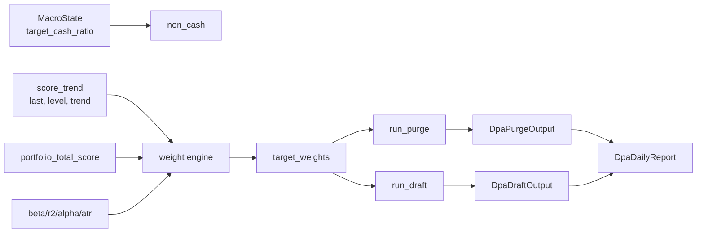
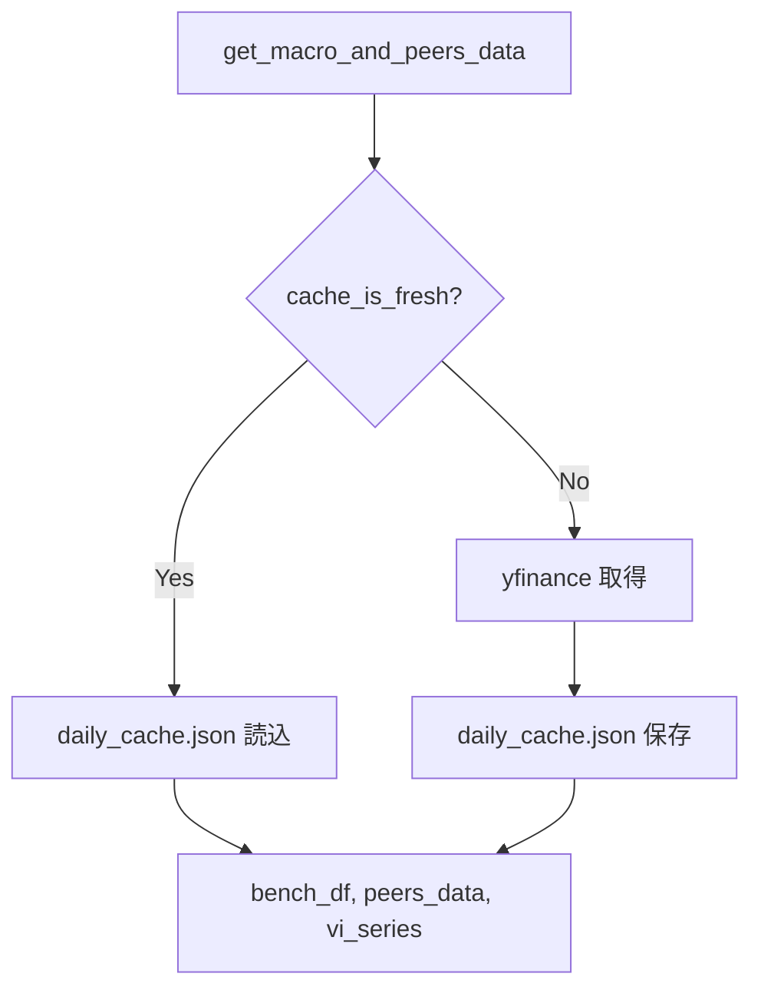
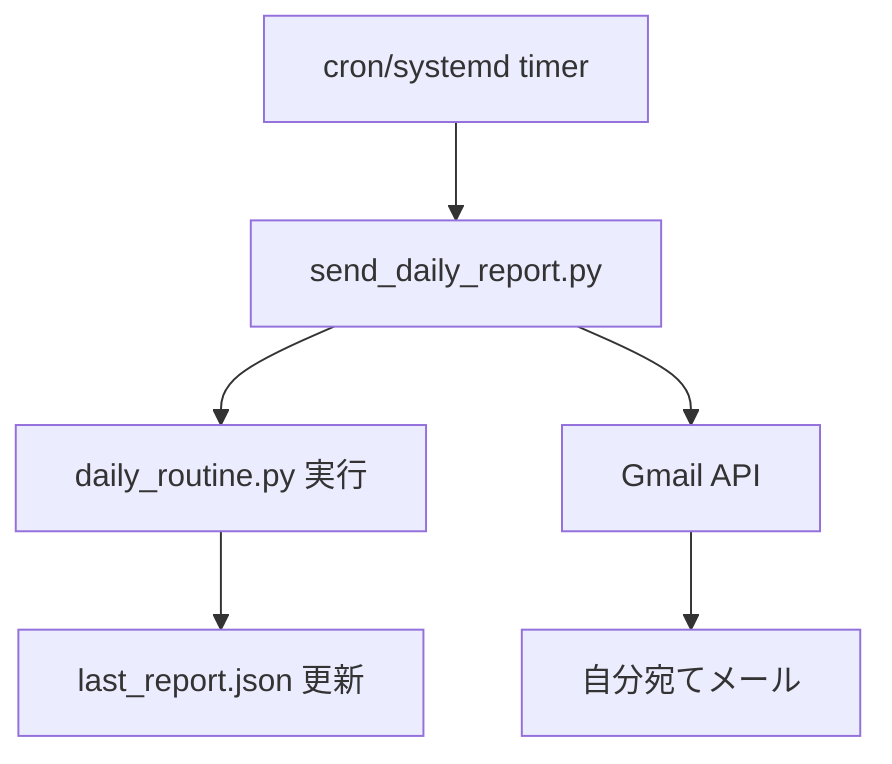

# アプリ構成（実装全体図）

このファイルは、`web/*`、`core/*`、`daily_routine.py`、`send_daily_report.py` を含む現行構成の正本です。

## 1. 全体コンポーネント

## 2. Web ルーティング構成

### 2.1 ページ（`web/main.py`）

- `GET /`, `GET /dashboard`: ダッシュボード
- `GET /report`: 日次レポート
- `GET /analyze`: 企業分析
- `GET /watchlist`: ウォッチリスト
- `GET /trade`: 取引画面（`/trade/`, `/Trade`, `/TRADE` は `/trade` へ 307）
- `GET /settings`: 設定画面

### 2.2 API（`web/api.py`）

- `GET /api/status`: バッチ進捗
- `POST /api/run_batch`: 日次バッチ非同期起動
- `POST /api/analyze`: 単銘柄 DVC 実行 + ウォッチ追加
- `POST /api/trade/purchase`: 購入記録
- `POST /api/trade/sale`: 売却記録
- `POST /api/settings/update`: `config.yaml` / `portfolio_state.json` 更新
- `GET /api/settings`: 設定取得
- `GET /api/report/merged`: レポート BFF 統合データ
- `GET /api/watchlist`: ウォッチ + positions
- `DELETE /api/watchlist/{ticker}`: 削除

## 3. 日次バッチ実行シーケンス

## 4. DVC 内部構成

## 5. DPA 内部構成

## 6. キャッシュアーキテクチャ

fresh 判定は `updated_date` だけでなく、平日/週末とカットオフ時刻（既定 6:00 JST）を使います。

## 7. BFF 統合データ生成

`/api/report/merged` は以下を統合します。

- `last_report.json`
- `previous_report.json`
- `watchlist` 由来 positions

生成フィールド:

- `holdings_merged`: `unrealized_pnl`, `prev_score`, `prev_trend`, `prev_price` 付き
- `watchlist_merged`: `rank`, `rank_change`, `price_change` 付き

## 8. テンプレートと API 依存

- `templates/dashboard.html`:
  - `/api/report/merged`, `/api/status`, `/api/run_batch`
- `templates/analyze.html`:
  - `/api/analyze`
- `templates/watchlist.html`:
  - `DELETE /api/watchlist/{ticker}`
- `templates/trade.html`:
  - `/api/trade/purchase`, `/api/trade/sale`
- `templates/settings.html`:
  - `/api/settings/update`
- `templates/report.html`:
  - `get_report_merged()` のサーバーサイドレンダリング

## 9. メール送信系アーキテクチャ

- OAuth トークンは `token.json`
- 初回または失効時は `credentials.json` + ブラウザ再認証
- 失敗時は失敗通知メールを送信

## 10. ファイル責務マップ（実装ファイル全体）

### 10.1 ルート

- `daily_routine.py`: 日次オーケストレーション、レポート JSON 更新
- `send_daily_report.py`: バッチ実行 + Gmail 通知

### 10.2 Web

- `web/main.py`: 画面ルーティングとテンプレート描画
- `web/api.py`: BFF API、設定更新、取引更新、バッチ起動

### 10.3 DVC

- `core/dvc/data_fetcher.py`: yfinance 取得・列正規化
- `core/dvc/indicators.py`: MACD/出来高Z/ATR/beta 等
- `core/dvc/scoring.py`: Value/Safety/Momentum 合成
- `core/dvc/dvc_batch.py`: ウォッチ全銘柄実行 + 履歴更新
- `core/dvc/dvc_phase1.py`: 単銘柄 CLI
- `core/dvc/ai_agent.py`: OpenAI 連携（任意）
- `core/dvc/schema.py`: DVC 出力モデル

### 10.4 DPA

- `core/dpa/dpa_macro.py`: マクロ判定（VI + MACD）
- `core/dpa/dpa_scores.py`: スコア履歴と trend 回帰
- `core/dpa/dpa_portfolio_score.py`: ポートフォリオ用スコア補正
- `core/dpa/dpa_weights.py`: ターゲット比率
- `core/dpa/dpa_purge.py`: 売却案（非対称丸め）
- `core/dpa/dpa_draft.py`: 購入案（動的 N）
- `core/dpa/dpa_lot.py`: ロット換算ユーティリティ
- `core/dpa/dpa_schema.py`: DPA モデル

### 10.5 Utils

- `core/utils/config_loader.py`: 設定読込・補正
- `core/utils/daily_cache.py`: マクロ/ピア日次キャッシュ
- `core/utils/watchlist_io.py`: watchlist SoT 操作
- `core/utils/io_utils.py`: JSON 保存・概要整形

## 11. テスト構成（仕様検証レイヤ）

- `tests/test_scoring.py`: DVC スコア計算検証
- `tests/test_data_fetcher.py`: 価格・ファンダ取得/整形検証
- `tests/test_dpa_macro.py`: VI/MACD/現金比率フェーズ検証
- `tests/test_dpa_scores.py`: 線形回帰 trend とタイムマシン補完検証
- `tests/test_dpa_portfolio_score.py`: ポートフォリオ補正スコア検証
- `tests/test_dpa_weights.py`: target weight 正規化/リスク補正検証
- `tests/test_dpa_purge.py`: 非対称丸め売却ロジック検証
- `tests/test_config_loader.py`: 設定補完・watchlist 上限読込検証
- `tests/test_api_settings_save.py`: `/api/settings/update` 変換保存検証
- `tests/test_daily_cache_fresh.py`: キャッシュ fresh 判定検証
