# DVC（分析アプリ）ロジックフローチャート

投資分析AIシステム『Dynamic Value & Catalyst (DVC)』の処理の流れを、Mermaid のフローチャートで示したドキュメントです。

---

## 5秒で分かる全体の流れ（DVC + DPA）

```mermaid
flowchart LR
  W[ウォッチリスト] --> DVC[DVCスコア計算]
  DVC --> S[スコア履歴更新]
  S --> T[スコアトレンド\n(5日・20日)]
  M[マクロ\nVI Z + MACD] --> C[目標現金比率\nとターゲット構成比]
  T --> C
  C --> R[リバランス計算\n(売却・購入)]
  R --> O[日次レポート出力]
```

1. **DVC** … ウォッチリスト銘柄の Value / Safety / Momentum と**市場・リスク指標（β, R², α, ATR%）**を計算し、日々の履歴を更新。
2. **トレンド & マクロ** … total_score の 5日・20日トレンドと、VI Zスコア + MACDトレンドから「今日どの銘柄をどれだけ持つか」と「現金比率」を連続的に決定。**ポートフォリオ用 total_score**（DVC スコア + β/R²/α/ATR、影響度は市場状況で変化）でターゲット構成比・購入順を決める（1銘柄上限は固定）。
3. **DPAリバランス** … 売りは「総資産に対する現在比率」と「全ウォッチ対象のターゲット構成比 `w_i^*`」の差分で判定。買いは「**ポートフォリオ用 total_score の降順**」で候補を並べたうえで、**仮想組入（Simulated Inclusion）と動的N最適化（Dynamic N-Optimization）**で N=1〜5 のシナリオをシミュレーションし、予算消化・分散・スコアのバランスが最も良いシナリオを自動選択してテキストレポートを出力。

---

## 1. DVC メインフロー（Phase1）

処理を「データ取得」「スコア計算」「出力」の3ブロックに分けて示します。

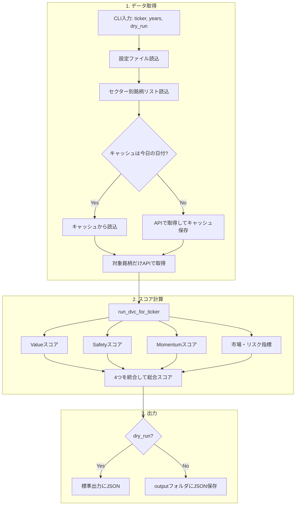

- **データ取得**: まずキャッシュの日付を確認。今日ならマクロ・代表銘柄はキャッシュから、対象銘柄だけ毎回API取得。今日でなければマクロ・代表銘柄もAPI取得してキャッシュを更新。
- **スコア計算**: 取得したデータで Value / Safety / Momentum / 市場リスクを計算し、重み付きで総合スコアに統合。
- **出力**: `--dry-run` なら標準出力にJSON、そうでなければ `output/<ticker>.json` に保存。

---

## 2. データ取得の詳細（日次キャッシュ・スケジュール考慮）

「マクロ・代表銘柄」は、**曜日と時刻**を考慮して「キャッシュを fresh とみなすか」を決め、不要な再取得を避けます。

- **週末**: 新規データは出ないため、前週金曜付きのキャッシュがあれば fresh（再取得しない）。
- **平日の市場終了前**: その日の終値はまだ出ていないため、直近営業日付きのキャッシュで十分とみなす。
- **平日のカットオフ後**（デフォルト 6:00 JST 以降）: 日本株・VIX など前日終値が揃った後とみなし、キャッシュは「今日」更新分のみ fresh。それ以外は再取得しない（前日以前のキャッシュで十分とみなす）。

設定は YAML の `cache.cutoff_hour` / `cache.cutoff_minute` / `cache.market_tz` で変更可能（未指定時は 6:00 JST）。

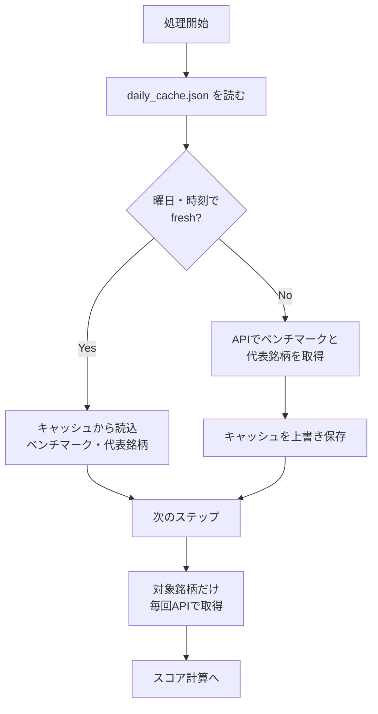

| キャッシュするもの | 毎回取得するもの |
|-------------------|------------------|
| ベンチマーク（例: 1306.T）の株価履歴 | `--ticker` で指定した銘柄の株価・ファンダメンタル |
| sector_peers に載っている代表銘柄の価格・BPS・EPS | （上記のみ） |

目的は、同一日に複数銘柄を回すときのAPI呼び出し削減と、「日付が変わったから」だけでは更新せず**意味のあるタイミングでだけ**データを更新することです。

---

## 3. DVC スコア計算の概要（4モジュール）

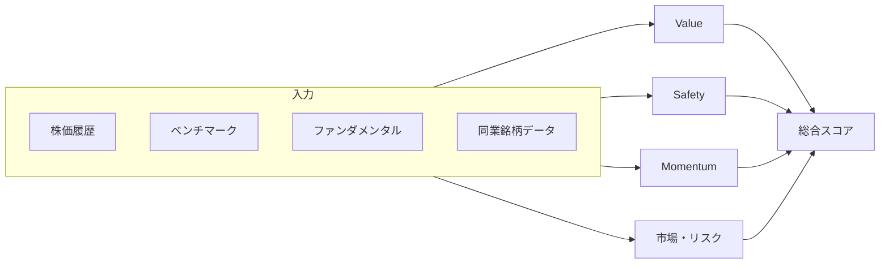

| モジュール | 役割 | 主な入力 |
|------------|------|----------|
| **Value** | 割安度（時間軸＋同業比較） | 株価、BPS/EPS、同業のPB/PE |
| **Safety** | 財務の健全性 | yfinance の財務指標 |
| **Momentum** | トレンドの強さ | MACD・出来高 |
| **市場・リスク** | 市場連動・変動幅 | 株価とベンチマークのリターン、ATR |

総合スコアは Value 40%・Safety 40%・Momentum 20% で加重平均しています。

---

## 4. モジュールA：Value Score（割安度）

「過去との比較」と「同業との比較」の2本立てです。

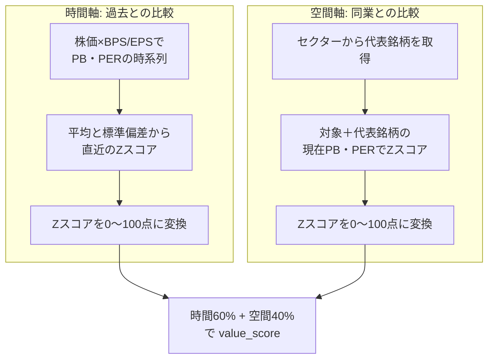

- **時間軸**: 過去数年分のPB/PERの平均から「今が割高か割安か」をZスコアで測り、点数化。
- **空間軸**: 同業の代表銘柄と並べて「相対的に割高か割安か」をZスコアで測り、点数化。
- 両方を 時間0.6 : 空間0.4 で足して `value_score`（0〜100）にします。

---

## 5. モジュールB：Safety Score（財務健全性）

Fスコア（簡易）と Altman Z を組み合わせています。

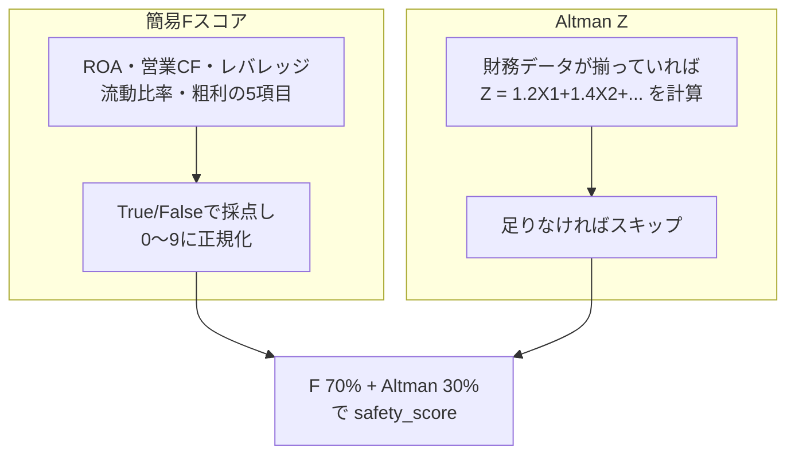

- Fスコア: 5つの財務シグナルを 0〜9 にまとめ、0〜100点に換算。
- Altman Z: 計算可能なら Z を出し、1.8 を基準に正規化したうえで 0〜100 点の**連続スコア**に変換。
- 両方を 7:3 で加重平均して `safety_score` にします（固定閾値 100/60/20 のような段差は使わず、なめらかな連続関数で評価）。

---

## 6. モジュールC：Momentum Score（トレンド）

MACDのゴールデンクロスと出来高の異常度を使います。

```mermaid
flowchart TD
  subgraph macd [MACD]
    M1[MACD・シグナルを計算]
    M2[直近のゴールデンクロスを検出]
    M3[クロスからの日数 d に応じて\n0〜100点の連続スコアに変換\n(新しいクロスほど高得点、日数とともに減衰)]
    M1 --> M2 --> M3
  end

  subgraph vol [出来高]
    V1[直近 vs 過去20日の\n平均・標準偏差]
    V2[Zスコアを0〜100点に変換]
    V1 --> V2
  end

  M3 --> mom[MACD 50% + 出来高 50%\nで momentum_score]
  V2 --> mom
```

- MACD: 直近でゴールデンクロスがいつだったかを使い、「クロスからの日数」が増えるほど指数的にスコアが減衰する**連続スコア**として「トレンドの新しさ」を評価。
- 出来高: 直近の出来高が過去20日と比べてどれだけ多いかをZスコアで点数化。
- 2つを 0.5 : 0.5 で足して `momentum_score` にします。

---

## 7. モジュールD：市場連動とリスク（β, R², α, ATR%）

銘柄の日次リターンとベンチマーク（例: TOPIX連動ETF）の日次リターンを単回帰し、さらに価格の変動幅から「市場感応度」と「リスクの大きさ」を算出します。

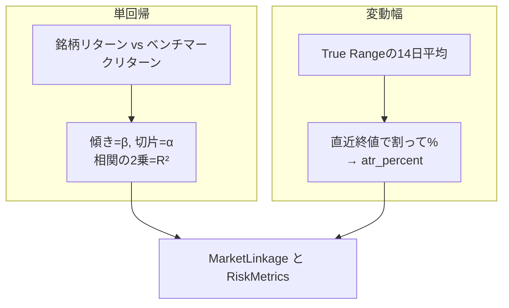

### 各指標の説明

| 指標 | 意味 | 読み方 |
|------|------|--------|
| **β（ベータ）** | ベンチマーク（市場）が 1% 動いたとき、その銘柄のリターンが平均して何%動くかを表す**感応度**。 | β = 1.2 → 市場が+1%の日は銘柄は平均して+1.2%程度動きやすい。β &lt; 1 は市場より動きが穏やか、β &gt; 1 は市場より振れが大きい。 |
| **R²（決定係数）** | 銘柄の値動きのうち、**市場の値動きで説明できる割合**（0〜1）。相関の2乗。 | R² = 0.7 → 値動きの約70%が市場と連動して説明できる。R² が高いほど「指数にべったり」、低いほど「独自の動き」が強い。 |
| **α（アルファ）** | 回帰で得られる**切片**。市場の動きで説明しきれない部分のリターン（日次ベース）。 | α &gt; 0 → 市場が横ばいでも、その銘柄は平均してわずかにプラスに寄る傾向。α &lt; 0 は逆。 |
| **ATR%（エーティーアール）** | **Average True Range** を直近終値で割った百分率。その銘柄の「1日でよくある値幅」の目安。 | ATR% = 3% → 日次で±3%程度の値動きがよくある。大きいほどボラティリティが高く、価格の振れが大きい銘柄。 |

- 計算方法（概要）: 銘柄とベンチマークの過去の日次リターンから「銘柄リターン = α + β × ベンチマークリターン」の回帰を行い、傾きが β、切片が α。相関の2乗が R²。ATR は High−Low 等で定義される True Range の14日移動平均を終値で割って%表示。
- これらは DVC の出力（`market_linkage`, `risk_metrics`）として `output/<ticker>.json` に保存され、**DPA の「ポートフォリオ用 total_score」**の計算に使われる（セクション 9.3・9.4・10 参照）。**1銘柄あたりの上限（15% or 75万円）はこれらの指標では変更せず固定**。

---

## 8. LLM連携（ai_analysis）

スコアと指標をLLMに渡し、短文コメントと損切り目安を生成します。

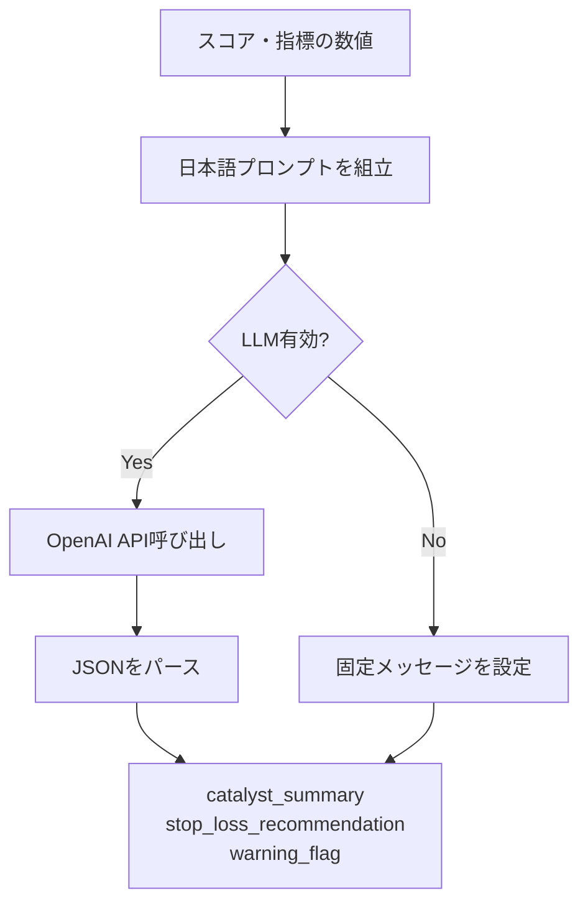

- `--dry-run` や LLM 未設定のときは「LLM未使用モード」の固定メッセージになります。
- LLM 有効時は、スコア・β/R²/α/ATR・Value のZスコアなどをプロンプトに含め、JSON形式で `catalyst_summary`・`stop_loss_recommendation`・`warning_flag` を返すよう指定しています。

---

---

## 9. DPA（Dynamic Portfolio Architect）のスコア＆トレンド駆動ロジック

### 9.1 マクロ判定（VI Zスコア + MACDトレンド）

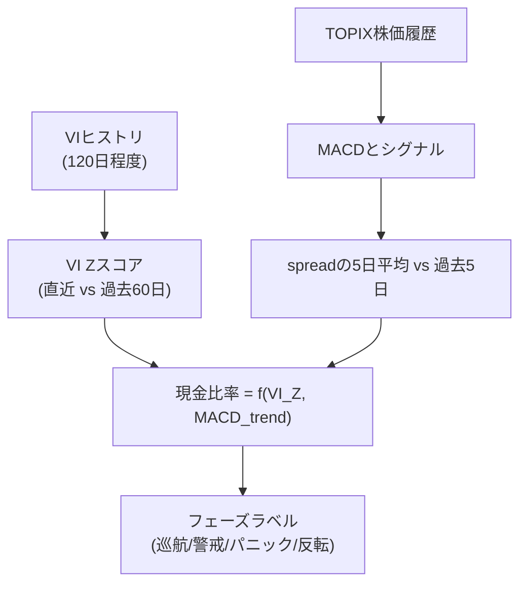

- VI の終値ヒストリから Zスコアを計算し、「いまの恐怖水準が過去分布のどこか」を見る。**日本株ポートフォリオでは日本向けVIを使うこと**（^VIX は米国指標のため不向き）。`vi_ticker` 未指定時は VI は使わず MACD のみで判定する。
- **日本向けのVI指標**: **日経平均VI**（日経ボラティリティー・インデックス）が日本市場の恐怖指数に相当する。日経225オプションから算出され、大阪取引所で公表されている。ただし **現状 yfinance では日経VIのヒストリが取得できない**ため、本システムでVIを使う場合は (1) 未指定のまま MACD のみで判定する、(2) J-Quants API（指数コード **NKVIF**）で取得する機能を別途実装する、(3) 日次実行時に `--vi <値>` で手動でVI値を渡す、のいずれかとなる。
- **VIX（^VIX）の確定時刻**: 米国市場の終値に合わせて確定する。米国東部 16:00 = **日本時間 翌朝 5:00（サマータイム中）または 6:00（冬時間）**。この時刻以降に日次バッチを回すと、前日米国終値の VIX がデータに含まれる。
- TOPIX の MACD スプレッドの変化からトレンド指標（-1〜+1）を作る。
- 現金比率は `mu_cash + a_vi * max(VI_Z, 0) - b_macd * MACD_trend` を1本の式で計算し、フェーズ名はこの現金比率から後付けで決める（閾値による段差は使わず連続値のみ）。パニック時は新規購入枠を 0 にするが、理論上の空き予算はレポートに表示する。

### 9.2 スコア履歴と 5日・20日トレンド

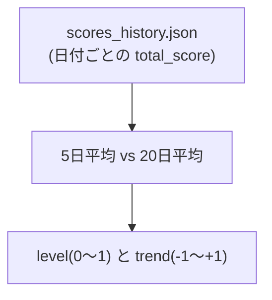

- DVC が毎日出す `total_score` を `scores_history.json` に蓄積。
- 各銘柄ごとに「直近スコアのレベル（0〜1）」と「5日平均 vs 20日平均の差」を [-1, +1] に正規化したトレンドとして計算。

### 9.3 ポートフォリオ用 total_score とターゲット構成比

**ポートフォリオ用 total_score**（`dpa_portfolio_score.compute_portfolio_total_score`）で、DVC の total_score に β, R², α, ATR% を加味した「新しいスコア」を銘柄ごとに算出する。**4指標の影響度は市場状況（目標現金比率＝防御度）で変える**：防御が強いときは高β・高R²の減点を強く、高ATRも減点；防御が弱いときはαの加点を強く、β・R²の減点は弱くする。

- このスコアを **level** の元としてターゲット構成比に使い、さらに **購入順** もこのスコアの降順で決める（「新しい total_score 順に購入」）。

ターゲット構成比 `w_i^*` は、**レベル＝ポートフォリオ用 total_score の 0〜1 正規化**・トレンド、および上記と同じ指標による **risk_factor** で調整した raw を正規化して求める。

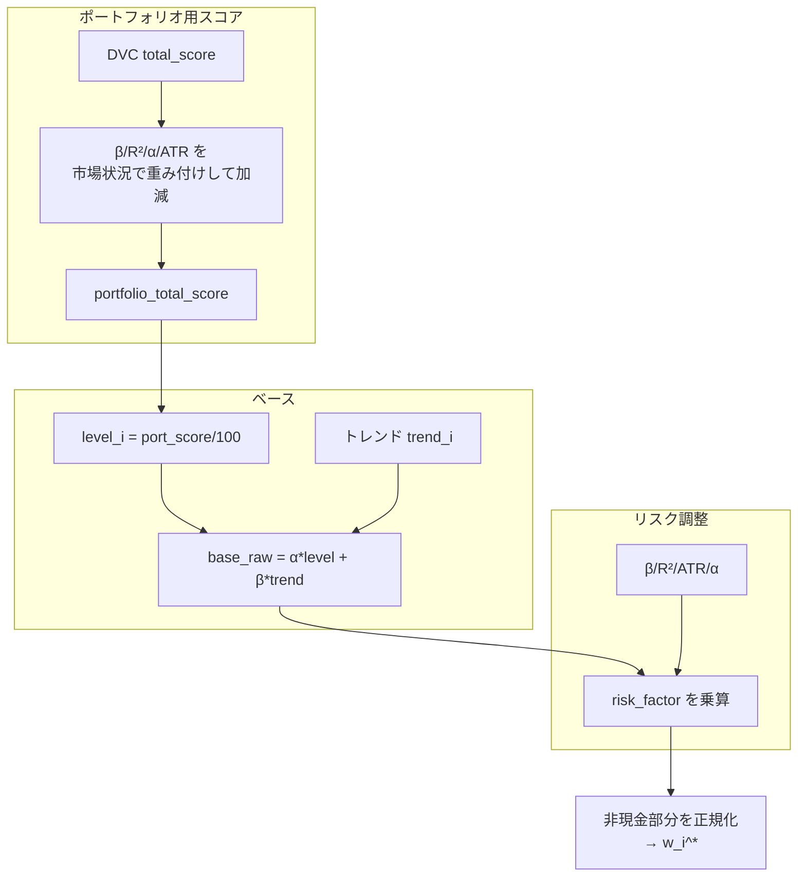

- **売り（パージ）**: 保有銘柄ごとに、**総資産に対する現在比率** `w` と、同じく総資産ベースの**全ウォッチ対象向けターゲット** `w_i^*`（`compute_target_weights` の出力）を比較する。`over = max(0, w - w_i^*)` が `over_weight_threshold`（既定 2%pt）を超えた銘柄を売却候補にする（`run_purge`）。保有のみに再正規化した比率は使わない。
- **買い**: 新規購入は**ポートフォリオ用 total_score の降順**で候補を並べ、予算・1銘柄上限（15%・75万円固定）・100株単位で割り当てる（後述）。

### 9.4 売却（パージ）と購入（ドラフト）

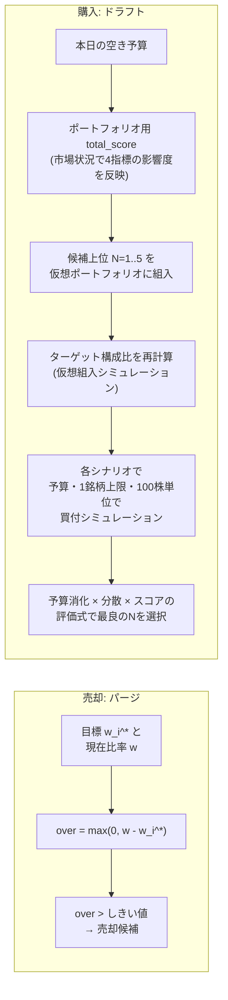

- **売却**: 各保有銘柄で `w`（総資産に対する現在比率）と `w_i^*`（`compute_target_weights` の当該銘柄の目標比率）を比較。`w` が `w_i^*` をしきい値以上上回ると売却候補。
- **購入**: 空き予算を先に決め、候補を**ポートフォリオ用 total_score（市場状況で β/R²/α/ATR の影響度を変えたスコア）の降順**で並べたうえで、上位 N=1〜5 を順に仮想ポートフォリオに組み入れて `compute_target_weights` を再計算し、「予算消化 × 分散銘柄数 × スコア（加重平均）」の評価式で最良の N を選択する。各シナリオ内では **固定の1銘柄上限（15% or 75万円）**・100株単位の制約を守る。

### 9.5 日次レポートの内容

- マクロ: 目標現金比率、フェーズ、VI Zスコア、MACDトレンド。
- ポートフォリオ概要: 総資産・現金・株式評価額、**本日新規購入枠**（パニック時は「理論上の最大額」と「防衛により実際の枠: 0円」の両方を表示）。
- 売却指示: パージで検出した銘柄と理由。
- **保有銘柄の状況**: 銘柄ごとに 現在%・目標%、score/level/trend、株価（保有銘柄のみ表示）。
- **ウォッチリスト優先度**: スコア順の一覧（目標%は表示しない）。会社名・ステータス(HOLDING/WATCHING)・株価を揃えて表示。
- 新規購入推奨: ドラフトで算出した銘柄・株数・予算。

---

## 10. DVC の市場・リスク指標が DPA で使われる場所

4指標（β, R², α, ATR%）は **ポートフォリオ用 total_score**（`dpa_portfolio_score.compute_portfolio_total_score`）の計算に使われ、**市場状況（防御度＝目標現金比率に連動）で各指標の影響度が変わる**。

| 指標 | 使う場所 | 役割（市場状況で影響度が変化） |
|------|----------|-------------------------------|
| **β** | ポートフォリオ用スコア・ターゲット構成比 | 防御が強いとき高βを強く減点、弱いとき減点は弱い |
| **R²** | ポートフォリオ用スコア・ターゲット構成比 | 防御時は高R²を強く減点、平常時は弱い |
| **α** | ポートフォリオ用スコア・ターゲット構成比 | プラスαは加点；リスクオン時により強く反映 |
| **ATR%** | ポートフォリオ用スコア・ターゲット構成比 | 高ボラは常に減点；防御時はやや強く |

- **ポートフォリオ用 total_score** の降順で**購入順**を決め、同じスコアをターゲット構成比の **level** としても使う（`dpa_weights` に `portfolio_scores` を渡す）。
- **1銘柄上限（15% or 75万円）**は、β/R²/ATR では変更せず**常に固定**です。
- DVC の `output/<ticker>.json` の `market_linkage`（β, r_squared, alpha）と `risk_metrics`（atr_percent）は、`dpa_portfolio_score`・`dpa_weights`・`dpa_draft` で参照されています。

---

*このドキュメントは DVC Phase 1 と DPA の最新実装（β/R²/α/ATR 活用・パージ・ドラフト・レポート仕様）に基づく。ポジションは `watchlist.json` の HOLDING に保持。*
