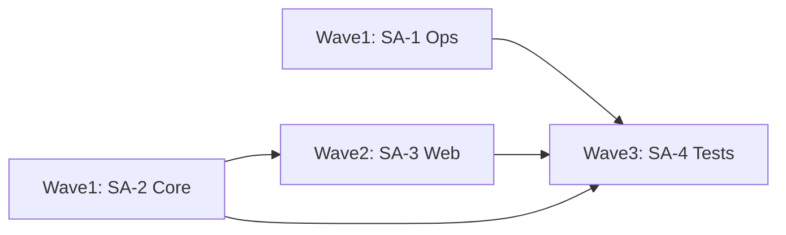

# 実装計画書（レビュー指摘対応）

作成日: 2026-05-22  
対象: `stock_v7` レビュー統合リストのうち **リポジトリ内コード・ドキュメント・テストのみ**（OAuth 失効・GitHub Private 化・本番デプロイは対象外）

実装は **サブエージェント（`dev-developer`、モデル `composer-2.5-fast`）** に委譲する。  
各エージェントは **担当ファイル以外を編集しない**（マージ競合防止）。

---

## 全体方針

| 項目 | 内容 |
|------|------|
| ゴール | データ破損・無認証 API・運用ドキュメント矛盾を解消し、回帰テストを追加する |
| 非ゴール | 本番 VPS 操作、GitHub 設定、資格情報ローテーション、履歴 rewrite |
| 完了定義 | `pytest tests/ -q` が全通過、未コミットの `.gitignore` 削除が解消、計画書の受入条件を満たす |
| 実行モデル | ウェーブ単位で並列起動。同一ファイルを触るエージェントは直列 |

---

## ウェーブ構成（依存関係）



| ウェーブ | サブエージェント | 並列 | 前提 |
|----------|----------------|------|------|
| 1 | SA-1, SA-2 | 可 | なし |
| 2 | SA-3 | SA-1 完了推奨（ドキュメント参照のため） | **SA-2 完了必須**（`watchlist_io`） |
| 3 | SA-4 | — | SA-2, SA-3 完了必須。SA-1 は完了済みであること |

---

## SA-1: 運用基盤・ドキュメント・デプロイスクリプト

**ID:** `impl-sa-1-ops`  
**subagent_type:** `dev-developer`  
**model:** `composer-2.5-fast`

### 担当範囲（このエージェントだけが編集可）

- `.gitignore`
- `docs/OPERATIONS.md`
- `deploy.sh`
- `scripts/setup_server.sh`
- `scripts/setup_conoha.sh`（venv 表記を触る場合のみ）

### 触らないファイル

- `web/**`, `core/**`, `tests/**`, `daily_routine.py`, `send_daily_report.py`

### タスク（5件）

| # | タスク | 受入条件 |
|---|--------|----------|
| 1.1 | `.gitignore` を HEAD 相当で復元し、`.env` / `venv` / `.pytest_cache` / `.DS_Store` を維持 | `git status` で `.gitignore` が deleted でない |
| 1.2 | 機密を追跡しないよう `.gitignore` に `token.json`, `credentials.json` を追加（既追跡ファイルの削除は **行わない**—コメントで手動手順を記載可） | ファイル内容に追記あり |
| 1.3 | `OPERATIONS.md` 44・212 行のマークダウン修正、`rsync` 節の誤記修正 | 誤った `` `**rsync` `` / `` `**.gitignore` `` が無い |
| 1.4 | `OPERATIONS.md` の運用方針を更新：機密は Git 非推奨、日常デプロイは `git pull` 正、`deploy.sh` は初回/レガシーと明記 | 全同期と機密管理が矛盾しない |
| 1.5 | `deploy.sh` / `setup_server.sh`：`VPS_IP` 等を環境変数化（未設定時はエラー）、rsync から機密・`data/`・`output/` を exclude、`--delete` 削除またはコメントで危険明示、venv は `[ -d venv ] \|\| python3 -m venv venv`、`OPERATIONS.md` の手順を **`venv` に統一**（`.venv` 記述を修正） | `deploy.sh` が docs と矛盾しない |

### 成果物

- 上記ファイルの diff
- SA-1 完了メモ（変更ファイル一覧・手動作業が残る場合は箇条書き）

### プロンプト用要約（親エージェントが Task に渡す文）

> SA-1: `.gitignore` 復元・強化、`docs/OPERATIONS.md` typo/方針/venv 統一、`deploy.sh` と `scripts/setup_server.sh` の冪等化・機密 exclude。`web/` `core/` `tests/` は編集禁止。完了後に変更一覧を返す。

---

## SA-2: コアロジック（DPA / 日次 / ウォッチリスト）

**ID:** `impl-sa-2-core`  
**subagent_type:** `dev-developer`  
**model:** `composer-2.5-fast`

### 担当範囲

- `core/utils/watchlist_io.py`
- `core/dpa/dpa_draft.py`
- `daily_routine.py`
- `core/dvc/dvc_batch.py`
- `send_daily_report.py`
- `core/dvc/scoring.py`（重複 yfinance 削減のみ、任意）

### 触らないファイル

- `web/**`, `docs/**`, `deploy.sh`, `scripts/**`, `tests/**`

### タスク（5件）

| # | タスク | 受入条件 |
|---|--------|----------|
| 2.1 | `update_holdings_bulk`：既存 HOLDING の `shares` を**加算**、平均単価は加重平均（新規は従来どおり） | 同一 ticker 2 回更新で株数が加算される（コメントまたは docstring で仕様明示） |
| 2.2 | `run_draft`：購入額を `max(0, target_jpy - current_holding_value)` ベースに変更 | 既存保有銘柄で目標以下なら追加買いゼロに近い挙動 |
| 2.3 | 論理日付関数を共通化（例: `core/utils/dates.py` 新設可）し、`daily_routine` の `data_date` と `dvc_batch` の履歴キーで**同一関数**を使用 | JST 0–5 時台のずれが解消 |
| 2.4 | `daily_routine` の `vi_value_override` / CLI `--vi` を `get_macro_state` に反映 | override 指定時にマクロ判定が変わる |
| 2.5 | `send_daily_report`：`run_status.json` を読み書きし Web バッチと状態を整合（既存パス・形式を踏襲） | ファイルが更新されるコードパスが存在 |

### 成果物

- コア diff
- 共有日付関数の場所と使い方（1 段落）

### プロンプト用要約

> SA-2: `watchlist_io` 加算購入、`dpa_draft` 増分、`data_date` 統一、`--vi` 実装、`run_status.json` 更新。`web/` `tests/` `docs/` は編集禁止。

---

## SA-3: Web 層（認証・永続化・取引 API）

**ID:** `impl-sa-3-web`  
**subagent_type:** `dev-developer`  
**model:** `composer-2.5-fast`

### 前提

- **SA-2 完了後**に起動（`watchlist_io` の加算仕様を利用）

### 担当範囲

- `web/main.py`
- `web/api.py`（**単一オーナー**—他エージェント禁止）

### 触らないファイル

- `core/**`（import のみ可）、`docs/**`, `tests/**`, `deploy.sh`

### タスク（6件）

| # | タスク | 受入条件 |
|---|--------|----------|
| 3.1 | 認証：`DPA_API_KEY` 環境変数（未設定時は開発モードでスキップ可と docstring 明記）。状態変更系 `/api/*` POST/DELETE に適用 | キー不一致で 401 |
| 3.2 | `main.py`：404 ハンドラで `html.escape`、本番向け `docs_url=None`（環境変数 `DPA_ENV=production` 等で切替可） | XSS パターンをエスケープ |
| 3.3 | `_read_json` / `_write_json`：temp + `os.replace` のアトミック書込 + モジュール `threading.Lock`（ファイルパス単位で可） | 同時書込でもファイル破損しにくい |
| 3.4 | `/run_batch`：グローバルロックで二重起動防止（409 維持） | 連続 POST でスレッド 1 本 |
| 3.5 | `trade_purchase` / `trade_sale`：sale の ticker 正規化（purchase 同等）、`output_dir` をプロジェクトルート配下に制限、500 の `detail` は本番で汎用メッセージ | パストラバーサル不可 |
| 3.6 | `trade_purchase`：SA-2 の `update_holdings_bulk` を利用（api 側での二重加算ロジックは入れない）。可能なら portfolio 更新失敗時ロールバック方針をコメント＋最小実装 | watchlist と cash の不整合を減らす |

### 任意（時間があれば同一エージェント内）

- POST body の Pydantic 化（`trade`, `settings/update` 優先）
- `update_settings` の範囲外値を 422 で返す

### 成果物

- `web/` diff
- 環境変数一覧（README または OPERATIONS への追記は **SA-1 に依頼せず**、SA-3 が `docs/OPERATIONS.md` に 3 行以内追記するか、完了メモに記載）

### プロンプト用要約

> SA-3: `web/main.py` + `web/api.py` のみ。API キー認証、XSS、JSON アトミック+ロック、バッチ二重起動防止、trade/sale 検証、output_dir 制限。SA-2 後。`core/` の編集禁止。

---

## SA-4: テスト・開発依存

**ID:** `impl-sa-4-tests`  
**subagent_type:** `dev-developer`  
**model:** `composer-2.5-fast`

### 前提

- **SA-2, SA-3 完了後**

### 担当範囲

- `tests/**`
- `requirements.txt` / `requirements-dev.txt`（新規作成可）

### 触らないファイル

- プロダクションコードの **挙動変更**（バグ修正目的の最小変更のみ可—原則テスト追加のみ）

### タスク（5件）

| # | タスク | 受入条件 |
|---|--------|----------|
| 4.1 | `test_watchlist_io` または既存テスト拡張：追加購入で株数・平均単価 | 2.1 の回帰 |
| 4.2 | `test_dpa_draft.py` 新規：既存保有で増分購入ゼロ付近 | 2.2 の回帰 |
| 4.3 | `test_api_trade.py` 新規（`TestClient`）：purchase/sale 400、認証 401、ticker 正規化 | 3.x の回帰 |
| 4.4 | `test_daily_cache_fresh.py` 拡張：カットオフ前の分岐（可能なら） | 1 件以上追加 |
| 4.5 | `test_config_loader` の `len(c) >= 0` 修正；`pytest tests/ -q` 全通過をログに記載 | 41+ passed、0 failed |

### 成果物

- テスト diff
- pytest 実行結果（コマンドと pass 数）

### プロンプト用要約

> SA-4: テストのみ追加・修正。watchlist 加算、draft 増分、API 認証・trade、cache。最後に `pytest tests/ -q` を実行して結果を報告。プロダクションコードは原則触らない。

---

## ファイルオーナーシップ一覧（競合防止）

| ファイル / ディレクトリ | オーナー |
|-------------------------|----------|
| `.gitignore`, `docs/OPERATIONS.md`, `deploy.sh`, `scripts/*.sh` | SA-1 |
| `core/utils/watchlist_io.py`, `core/dpa/dpa_draft.py`, `daily_routine.py`, `core/dvc/dvc_batch.py`, `send_daily_report.py` | SA-2 |
| `web/main.py`, `web/api.py` | SA-3 |
| `tests/**`, `requirements*.txt` | SA-4 |

---

## 親エージェントの起動手順（実装フェーズ用）

1. **Wave 1** — Task ×2 並列: SA-1, SA-2（各プロンプトに「担当外ファイル編集禁止」を明記）
2. SA-2 の完了を確認 → **Wave 2** — Task ×1: SA-3
3. SA-3 の完了を確認 → **Wave 3** — Task ×1: SA-4
4. 親が `git diff --stat` と `pytest` を再実行し、計画書の受入条件をチェック

### Task 起動テンプレート（共通フッター）

各サブエージェント prompt の末尾に付与:

```
リポジトリ: /Users/kosei/Library/CloudStorage/Box-Box/Personal/dev/stock_v7
計画書: docs/IMPLEMENTATION_PLAN.md の「SA-X」セクションのみ実施
担当外ファイルは編集しない。完了時に変更ファイル一覧と受入条件の達成状況を日本語で返す。
コミット・push・gh repo は行わない。
```

---

## 手動作業（計画書外・ユーザー）

実装完了後も残る作業（サブエージェントでは行わない）:

1. Google OAuth 失効・再発行  
2. GitHub Private 化・`token.json` 等の履歴除去  
3. VPS: FW、TLS、`systemctl restart`、環境変数 `DPA_API_KEY` 設定  

---

## リスクと緩和

| リスク | 緩和 |
|--------|------|
| SA-3 が `watchlist_io` 仕様と二重実装 | SA-2 完了後に SA-3 起動。purchase は bulk のみ呼ぶ |
| 認証追加で既存テスト失敗 | SA-4 で `DPA_API_KEY` をテスト用に設定 |
| `.gitignore` で既追跡機密が残る | SA-1 は ignore 追加のみ。除去は手動手順を OPERATIONS に 1 節追加可 |

---

## 進捗チェックリスト（親エージェント用）

- [x] Wave 1: SA-1 完了（2026-05-22）
- [x] Wave 1: SA-2 完了（2026-05-22）
- [x] Wave 2: SA-3 完了（2026-05-22）
- [x] Wave 3: SA-4 完了（pytest **54 passed**, 0 failed）
- [ ] 手動作業メモをユーザーに共有
