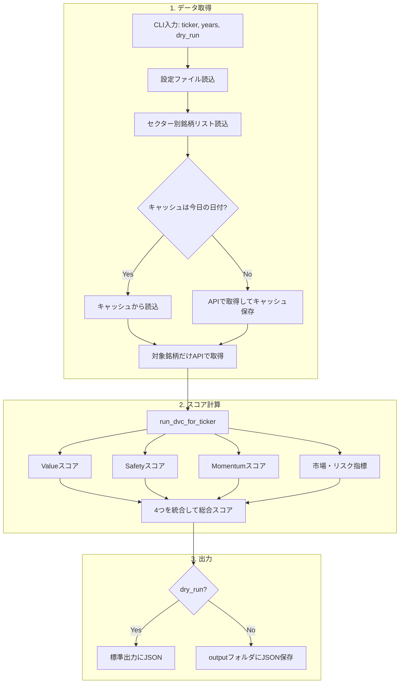
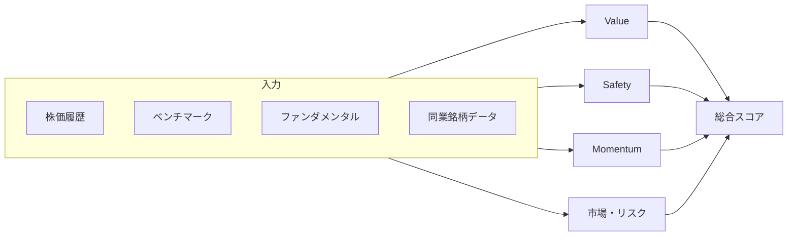
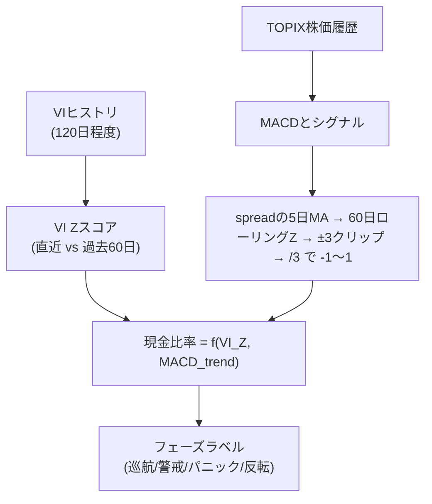
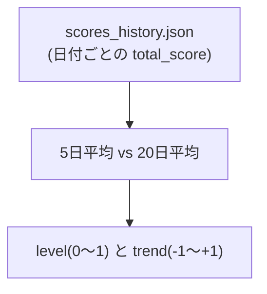
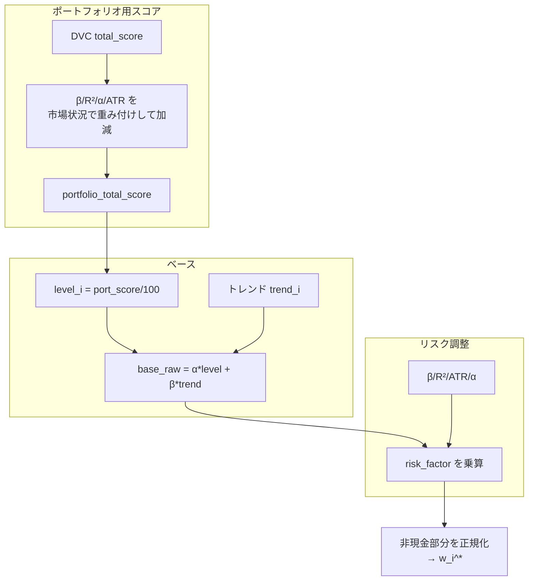
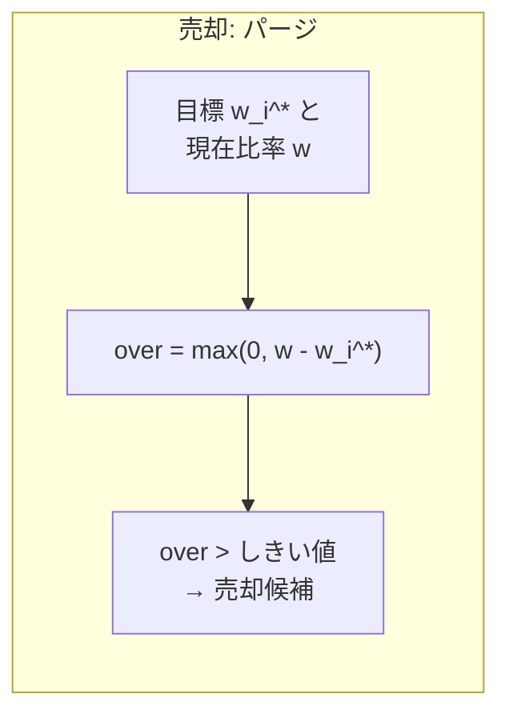
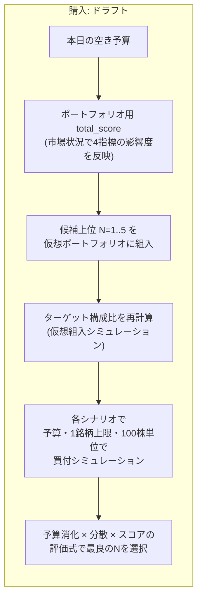

## DVC + DPA システム全体像（統合ドキュメント）

本ドキュメントは、`DVC_FLOWCHARTS.md` と `DATA_AND_LOGIC.md` の内容を統合し、  
**フローチャートによる全体像**と**データ構造・ビジネスロジックの仕様**を一冊にまとめたものです。

---

## 1. 5秒で分かる全体の流れ（DVC + DPA）

```mermaid
flowchart LR
  W[ウォッチリスト] --> DVC[DVCスコア計算]
  DVC --> S[スコア履歴更新]
  S --> T[スコアトレンド\n(5日・20日)]
  M[マクロ\nVI Z + MACD] --> C[目標現金比率\nとターゲット構成比]
  T --> C
  C --> R[リバランス計算\n(売却・購入)]
  R --> O[日次レポート出力]
```

1. **DVC**  
   ウォッチリスト銘柄の Value / Safety / Momentum と  
   **市場・リスク指標（β, R², α, ATR%）**を計算し、日々の履歴を更新。
2. **トレンド & マクロ**  
   `total_score` の 5日・20日トレンドと、VI Zスコア + MACDトレンドから  
   「今日どの銘柄をどれだけ持つか」と「現金比率」を連続的に決定。  
   **ポートフォリオ用 total_score**（DVC スコア + β/R²/α/ATR、影響度は市場状況で変化）で  
   ターゲット構成比・購入順を決める（1銘柄上限は固定）。
3. **DPAリバランス（売却＋購入）**  
   売りは「保有銘柄だけのターゲット比率」との差分で判定。  
   買いは「**ポートフォリオ用 total_score の降順**」で候補を並べたうえで、  
   **仮想組入（Simulated Inclusion）＋動的N最適化（Dynamic N-Optimization）**で N=1〜5 のシナリオをシミュレーションし、  
   予算消化・分散・スコアのバランスが最も良いシナリオを自動選択してテキストレポートを出力。

---

## 2. プロジェクト構成（抜粋）

```text
stock_v7/
├── daily_routine.py      # 日次バッチのエントリポイント
├── send_daily_report.py  # 日次レポートメール送信（cron）
├── config.yaml           # アプリ設定（単一ファイル）
├── portfolio_state.json  # 現金残高（dpa.portfolio_path で変更可能）
│
├── data/                 # 永続化データ（JSON）
│   ├── watchlist.json    # ウォッチ＋保有（HOLDING に株数・単価）
│   ├── sector_peers.json
│   ├── daily_cache.json
│   ├── scores_history.json
│   ├── last_report.json
│   └── previous_report.json  # 前回実行の退避（Web の比較表示用）
│
├── web/                  # FastAPI + Jinja2（ダッシュボード・レポート・取引など）
│   ├── main.py
│   └── api.py
│
├── core/
│   ├── dvc/              # DVC（Dynamic Value & Catalyst）
│   │   ├── dvc_phase1.py         # 1銘柄用CLI
│   │   ├── dvc_batch.py          # ウォッチリスト一括DVC
│   │   ├── scoring.py            # スコア計算の中心
│   │   ├── schema.py             # DVC 出力の Pydantic モデル
│   │   ├── indicators.py         # テクニカル・ファンダ指標
│   │   ├── data_fetcher.py
│   │   └── ai_agent.py           # LLM 要約（オプション）
│   │
│   ├── dpa/              # DPA（Dynamic Portfolio Architect）
│   │   ├── dpa_macro.py         # マクロ判定・目標現金比率
│   │   ├── dpa_scores.py        # スコア履歴・トレンド
│   │   ├── dpa_portfolio_score.py  # ポートフォリオ用 total_score
│   │   ├── dpa_weights.py       # ターゲット構成比
│   │   ├── dpa_purge.py         # 売却候補（パージ）
│   │   ├── dpa_draft.py         # 購入候補（ドラフト）
│   │   └── dpa_schema.py        # DPA の Pydantic モデル
│   │
│   └── utils/
│       ├── config_loader.py
│       ├── daily_cache.py
│       ├── watchlist_io.py
│       └── io_utils.py
│
├── output/               # DVC 出力（output/<ticker>.json）
└── docs/
```

デフォルトの JSON パス・設定のネスト構造（`dpa:` / `watchlist:` 等）は、`DATA_AND_LOGIC.md` の「デフォルトパス一覧」「設定の読み込み」を参照してください。  
**ポジション**は別ファイルではなく `watchlist.json` の `HOLDING` 行に保持し、`positions_from_watchlist()` が内部表現に変換します。

---

## 3. DVC（Dynamic Value & Catalyst）のフロー

### 3.1 DVC メインフロー（Phase1）



- **データ取得**:  
  キャッシュの日付を見て「今日として fresh か」を判定し、  
  ベンチマーク・代表銘柄・VI は原則 1 日 1 回だけ取得。  
  対象銘柄の株価・ファンダメンタルは毎回 API 取得。
- **スコア計算**:  
  Value（時間軸＋空間軸）、Safety（Fスコア＋Altman Z）、Momentum（MACD＋出来高）、  
  市場・リスク（β, R², α, ATR%）を算出し、加重平均で `total_score` を作る。
- **出力**:  
  乾燥ラン（`--dry-run`）なら標準出力に JSON、  
  そうでなければ `output/<ticker>.json` に保存。

### 3.2 DVC スコア計算モジュール



- **Value**: 時間軸（過去の PB/PE Zスコア）と空間軸（ピア比較 Zスコア）を 0〜100 化。
- **Safety**: 簡易 F スコア ＋ Altman Z を組み合わせて 0〜100 化。
- **Momentum**: MACD ゴールデンクロス鮮度＋出来高 Z を 0〜100 化。
- **市場・リスク**: 回帰から β・R²・α、ATR% を算出し、`market_linkage` / `risk_metrics` として保持。  
- **total_score**: value 0.4, safety 0.4, momentum 0.2 で加重平均。

その他の詳細（Zスコアのマッピング式など）は `DATA_AND_LOGIC.md` の「DVC ロジック」節を参照してください。

---

## 4. DPA（Dynamic Portfolio Architect）のフロー

### 4.1 マクロ判定とターゲット構成比



- VI Z スコアとベンチマーク MACD トレンドから、  
  `cash = mu_cash + a_vi*max(vi_z, 0) - b_macd*macd_trend` を計算し 0.2〜0.8 にクリップ。  
  これを **目標現金比率**とし、その値からフェーズ（CRUISE/CAUTION/PANIC/REVERSAL）をラベル付け。
- フェーズはあくまで「ラベル」であり、意思決定は連続値の `target_cash_ratio` ベース。

### 4.2 スコア履歴とトレンド



- `scores_history.json` に蓄積された `total_score` の履歴から、  
  各銘柄の `level`（0〜1）と `trend`（-1〜+1）を計算。

### 4.3 ポートフォリオ用 total_score とターゲット構成比



- **ポートフォリオ用 total_score**:  
  DVC の `total_score` をベースに、β・R²・α・ATR% を  
  マクロ防御度に応じて加減したスコア（`dpa_portfolio_score.compute_portfolio_total_score`）。
- **ターゲット構成比 `w_i^*`**:  
  `level`（ポートフォリオスコアの 0〜1 正規化）と `trend` から base_raw を作り、  
  β/R²/ATR/α による `risk_factor` を掛けて正規化したもの。  
  非現金部分 `1 - target_cash_ratio` をこの比率で割り振る。

---

## 5. リバランス（売却と購入）

### 5.1 売却（パージ）



- 対象は **保有銘柄のみ**。
- 目標比率 `w_i^*` は `compute_target_weights` で、**保有銘柄だけ**を母集団として `non_cash = 1 - target_cash_ratio` を山分けした総資産ベースの比率（未保有のウォッチ銘柄は 0）。これと総資産に対する現在比率 `w` を比較し、`over = max(0, w - w_i^*)` が `over_weight_threshold`（デフォルト 2%pt）を超えた銘柄を売却候補にする（`dpa_purge.run_purge`）。
- フェーズが PANIC のときは理由を `MACRO_PANIC`、それ以外は `SCORE_DECAY` として DpaPurgeOutput に載せる。

### 5.2 購入（ドラフト）― 仮想組入 & 動的N最適化



**アルゴリズム概要（dpa_draft.run_draft）**

- **空き予算**:  
  `raw_available_budget = max(0, cash_current - total_capital_actual * target_cash_ratio)`  
  パニック or 非正のときは `available_budget = 0`, `recommendations = []`。

- **候補抽出**:
  - ウォッチリストの **WATCHING** の銘柄（**保有済みも含む**）。着火点 `momentum_score` を満たすもの。
  - `momentum_score >= momentum_threshold`（デフォルト 50）。
  - これらを `portfolio_scores`（なければ `compute_portfolio_total_score`）で  
    **ポートフォリオ用 total_score 降順**にソート。

- **仮想組入（Simulated Inclusion） & 動的N最適化（Dynamic N-Optimization）**:
  - `N = 1 .. MAX_DRAFT_CANDIDATES`（デフォルト 5、候補数がそれ以下なら候補数まで）でループ。
  - 各 N について:
    - 上位 N 銘柄と既存保有銘柄の集合を「仮想ポートフォリオ」として構成。
    - その仮想ポートフォリオだけを対象に `compute_target_weights` を再度呼び、  
      仮想ターゲット構成比 `simulated_weights` を算出。
    - `scenario_budget = available_budget` からスタートし、上位 N 候補を順に:
      - `w = simulated_weights[ticker]` から `target_jpy = total_capital_actual * w` を計算。
      - 1銘柄上限 `max_pos_value = min(MAX_POSITION_PCT * total_capital_actual, MAX_POSITION_JPY)` でクリップ。
      - `lot_cost = price * lot_size` を用い、  
        `max_lots_by_target = floor(target_jpy / lot_cost)`、  
        `max_lots_by_budget = floor(scenario_budget / lot_cost)` を計算。
      - `lots = min(max_lots_by_target, max_lots_by_budget)` ロットだけ購入（0以下ならスキップ）。  
        `shares = lots * lot_size`, `cost = shares * price` とし、`scenario_budget -= cost`。
      - `BuyRecommendation`（ticker, name, shares, limit_price=None, score, budget_used）を `scenario_buys` に追加。

- **シナリオ評価**:
  - `scenario_buys` が空なら `scenario_score = 0`。
  - そうでなければ:
    - `total_spent = available_budget - scenario_budget`
    - `utilization = total_spent / available_budget`（予算消化率）
    - `count = len(scenario_buys)`（分散銘柄数）
    - `weighted_score = Σ(score_i * budget_used_i) / total_spent`（購入額で重み付けした平均スコア）
    - 評価式:  
      \[
      scenario\_score = weighted\_score \times (1 + 0.1 \times count) \times utilization
      \]
      （0.1 は分散ボーナス係数）

- **最適シナリオの採用**:
  - N=1〜`MAX_DRAFT_CANDIDATES` の中で `scenario_score` が最大のシナリオを採用。
  - そのシナリオの `scenario_buys` を `DpaDraftOutput.recommendations` に、  
    `available_budget - scenario_budget`（消費額）を `DpaDraftOutput.available_budget` に反映。
  - `recommendations` は最終的に **score 降順**でソートして返す。

---

## 6. 日次バッチ全体フロー（daily_routine.run_daily_routine）

```mermaid
flowchart TD
  A1[ウォッチリスト読込] --> A2[DVC一括実行\n(run_dvc_for_watchlist)]
  A2 --> A3[スコア履歴更新\nscores_history.json]
  A3 --> B1[positions/portfolio_state 読込]
  B1 --> B2[現在構成比・総資産計算]
  B2 --> C1[マクロ判定\n(get_macro_state)]
  C1 --> D1[スコアトレンド\n(dpa_scores)]
  D1 --> D2[ポートフォリオ用 total_score\n(dpa_portfolio_score)]
  D2 --> D3[ターゲット構成比\n(dpa_weights)]
  D3 --> E1[売却判定\n(run_purge)]
  D3 --> F1[購入判定\n(run_draft)]
  E1 --> G1[DpaDailyReport 組立]
  F1 --> G1
  G1 --> H1[JSON保存\n(data/last_report.json)]
  G1 --> H2[テキスト出力\n(format_report)]
```

1. **ステップ1: DVC 実行**  
   ウォッチリスト全銘柄に対して `run_dvc_for_watchlist` を実行し、  
   `output/<ticker>.json` と `scores_history.json` を更新。
2. **ステップ2: 現在ポートフォリオ読込**  
   `watchlist`・`portfolio_state` を読み、`positions_from_watchlist` で保有を取得。  
   `current_prices`・`holdings`・`current_weights`・`total_capital` を算出。
3. **ステップ3: マクロ判定**  
   `get_macro_and_peers_data` から bench_df・vi_series を取得し、  
   `get_macro_state` で `target_cash_ratio` とフェーズを決定。
4. **ステップ4: スコアトレンド・ターゲット構成比**  
   `compute_score_trend` → `compute_portfolio_total_score` → `compute_target_weights`。
5. **ステップ5: パージ（売却）**  
   `run_purge` でオーバーウェイト銘柄を洗い出し。
6. **ステップ6: ドラフト（購入）**  
   WATCHING 銘柄（保有・未保有を問わず、着火点を満たすもの）を対象に、**仮想組入＋動的N最適化**付きの `run_draft` で購入候補を決める。
7. **ステップ7: レポート生成**  
   `DpaDailyReport` を組み立て、`data/last_report.json` に保存（必要に応じ `previous_report.json` に退避）、テキストを出力。

---

## 7. 型・スキーマ／定数（サマリ）

詳細なフィールド定義は `DATA_AND_LOGIC.md` の「スキーマ一覧」と「定数・ビジネスルールまとめ」を正としますが、  
DPA 関連の主な型と新規アルゴリズム関連の定数だけここにも抜粋します。

### 7.1 DPA 主要スキーマ（dpa_schema）

- `MacroPhase`: CRUISE / CAUTION / PANIC / REVERSAL  
- `MacroState`: phase, phase_name_ja, target_cash_ratio, vi_z, macd_trend  
- `DpaPurgeOutput`: phase, items, total_count  
- `BuyRecommendation`: ticker, name, shares, limit_price, score, budget_used  
- `DpaDraftOutput`: phase, available_budget, raw_available_budget, recommendations  
- `DpaDailyReport`: target_cash_ratio, phase, phase_name_ja, vi_z, macd_trend,  
  cash_yen, total_capital_yen, equity_value_yen, ticker_names, last_prices,  
  current_weights, target_weights, score_trends, portfolio_scores, purge, draft, report_text

### 7.2 代表的な定数・ルール

- ウォッチリスト上限: `config.yaml` の `watchlist.max_items`（既定 30。`get_validated_config` → Web/API が `watchlist_io` に反映）
- キャッシュ fresh 判定のカットオフ: 6:00 JST（`daily_cache.DEFAULT_CACHE_CUTOFF_*`）
- 総合スコアの重み: value 0.4, safety 0.4, momentum 0.2（`scoring._combine_scores`）
- 目標現金比率の式: `mu_cash + a_vi*max(vi_z,0) - b_macd*macd_trend`（`dpa_macro._continuous_cash_ratio`）
- フェーズ境界: cash ≤0.3 CRUISE, ≤0.5 CAUTION, ≥0.7 PANIC, それ以外 REVERSAL（`dpa_macro._phase_from_cash`）
- 1銘柄上限: `min(総資産の 15%, 75 万円)`（`dpa_macro.MAX_POSITION_*`）
- パージのオーバー閾値: 2%（`dpa_purge.run_purge`）
- 着火点モメンタム: 50.0（`dpa_draft.DEFAULT_IGNITION_MOMENTUM_THRESHOLD`）
- 売買単位: 100 株（`dpa_draft.LOT_SIZE`）
- 動的Nシミュレーションの最大候補数: 5 銘柄（`dpa_draft.MAX_DRAFT_CANDIDATES`）
- ターゲット重みの level/trend 係数: alpha_level=0.7, beta_trend=0.3（`dpa_weights.compute_target_weights`）

---

## 8. 位置づけ

- **この `SYSTEM_OVERVIEW.md`**:  
  図と要約で「全体の流れ」と「主要ロジックの輪郭」をつかむための統合ドキュメント。
- **`DATA_AND_LOGIC.md`**:  
  型定義・データ構造・アルゴリズムの詳細仕様や境界条件を記述したリファレンス。
- **`DVC_FLOWCHARTS.md`**:  
  フローチャート主体のビジュアル解説。今後は本ドキュメントを主に参照しつつ、  
  より細かい仕様は `DATA_AND_LOGIC.md` を正として更新します。

